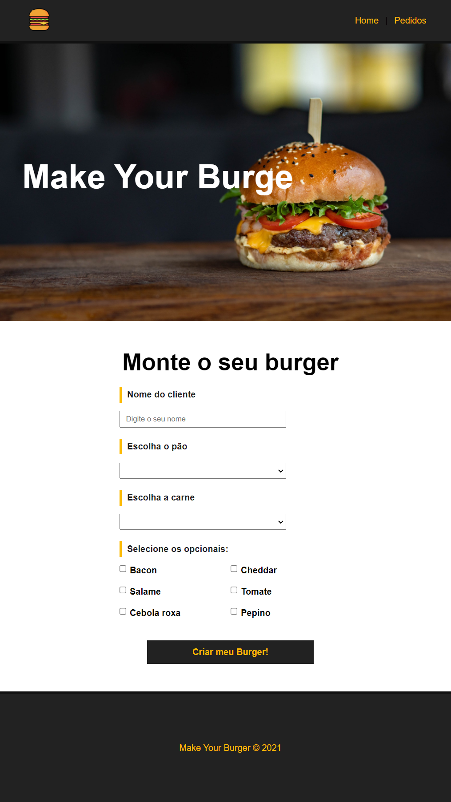
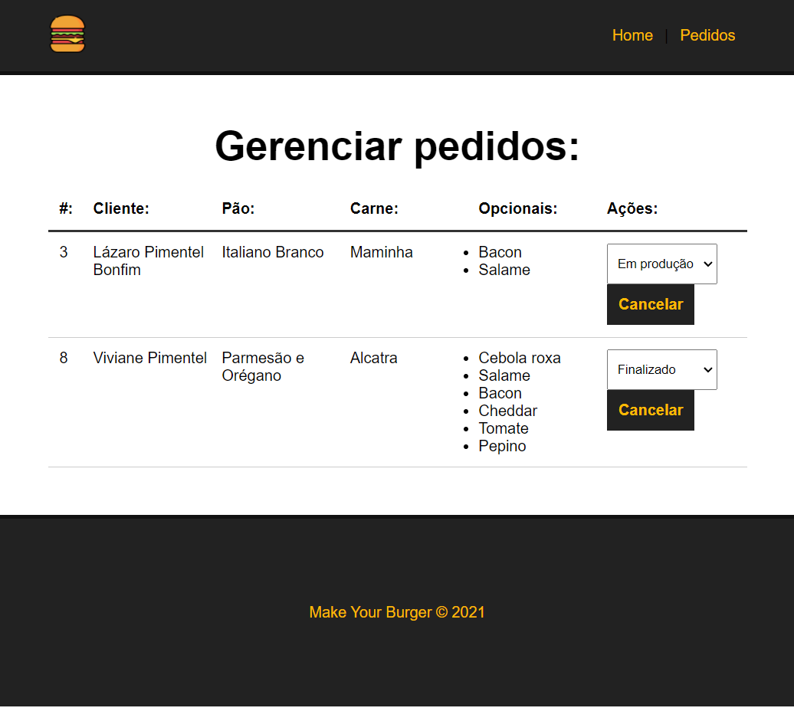

# make_your_burguer_in_vue

Site que faz pedidos de hamburguers, projeto criado com objetivo de desenvolver habilidades em VUE.js.

- [x] Criando API com JSON server
- [x] Implementação de Vue Router
- [x] Aplicação em componentes
- [x] Sistema de Mensagens
- [x] Atualização de pedidos/status

## Resultado Final 

### Página Principal (Fazer Pedidos)



<hr>

### Página de Pedidos (Gerencia pedidos)




## Project setup
```
npm install
```

### Compiles and hot-reloads for development
```
npm run serve
```

### Compiles and minifies for production
```
npm run build
```

### Customize configuration
See [Configuration Reference](https://cli.vuejs.org/config/).
